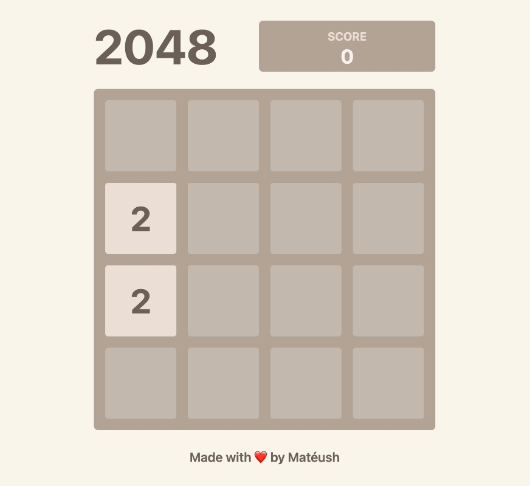

# 2048-in-react

[![Open issues][issues-badge]][issues-url]
[![CI][lint-badge]][lint-url]
[![CI][test-badge]][test-url]
[![TypeScript][typescript-badge]][typescript-url]

## [Play 2048 💥](https://mateuszsokola.github.io/2048-in-react/)

## Features

- Fully-functional 2048 clone
- Animations
- Supports **keyboard**, **mouse** and **touch** events

## Development

_Easily set up a local development environment!_

Just start dev server on [localhost](http://localhost:3000):

- clone
- `npm install`
- `npm run dev`

**Start coding!** 🎉

## Build your own 2048 Game! 🚀

[lint-badge]: https://github.com/mateuszsokola/2048-in-react/actions/workflows/lint.yml/badge.svg
[lint-url]: https://github.com/mateuszsokola/2048-in-react/actions/workflows/actions/workflows/lint.yml
[test-badge]: https://github.com/mateuszsokola/2048-in-react/actions/workflows/test.yml/badge.svg
[test-url]: https://github.com/mateuszsokola/2048-in-react/actions/workflows/test.yml
[issues-badge]: https://img.shields.io/github/issues/mateuszsokola/2048-in-react
[issues-url]: https://github.com/mateuszsokola/2048-in-react/issues
[typescript-badge]: https://badges.frapsoft.com/typescript/code/typescript.svg?v=101
[typescript-url]: https://github.com/microsoft/TypeScript
