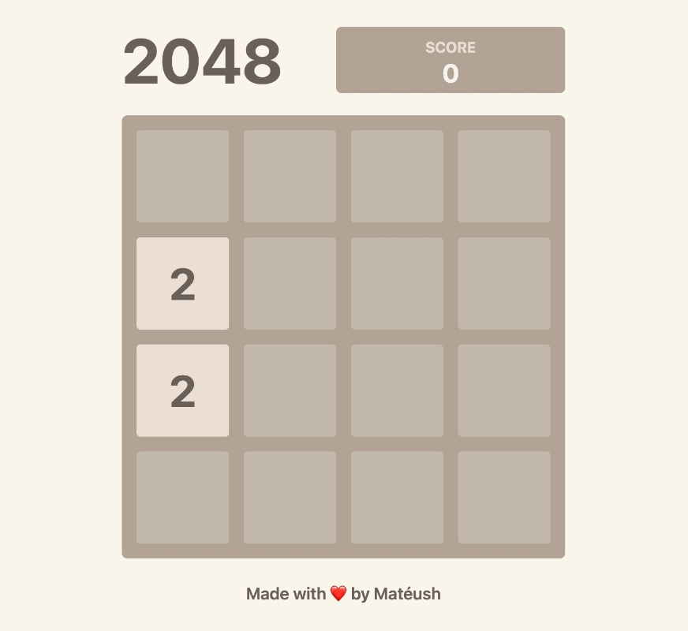

# 2048-in-react

[![Open issues][issues-badge]][issues-url]
[![CI][lint-badge]][lint-url]
[![CI][test-badge]][test-url]
[![TypeScript][typescript-badge]][typescript-url]

This is a fully functional clone of the popular 2048 game, built using React and Next.js. Not only does it offer smooth animations and works on mobile devices, but it's also a fantastic learning resource for developers. Whether you're here to play, contribute, or learn, this project has something for everyone.

If you're interested in mastering React by building this game step-by-step, check out the course linked below!

## [Play 2048 💥](https://mateuszsokola.github.io/2048-in-react/)

## Features

- Fully-functional 2048 clone
- Smooth tile animations
- Supports **keyboard** and **touch** (swipe) events
- Win and game-over detection with a splash screen
- Share your score on game over via the **Web Share API**, with a **Facebook Instant Games** fallback
- Static export ready for deployment to GitHub Pages or Facebook Instant Games

## Tech stack

- [React 19](https://react.dev/) & [Next.js 15](https://nextjs.org/) (static export)
- [TypeScript](https://www.typescriptlang.org/)
- [Jest](https://jestjs.io/) + [React Testing Library](https://testing-library.com/) for tests

## Development

_Easily set up a local development environment!_

- clone the repo
- `npm install`
- copy the environment template: `cp .env.example .env.local` (then fill in the values)
- `npm run dev` and open [localhost:3000](http://localhost:3000)

**Start coding!** 🎉

### Environment variables

Configuration lives in `.env.local` (copied from `.env.example`). Variables
prefixed with `NEXT_PUBLIC_` are inlined into the published bundle:

| Variable | Description |
| --- | --- |
| `NEXT_PUBLIC_GAME_URL` | The shareable "play" link used by the Web Share fallback. |

### Scripts

| Command | Description |
| --- | --- |
| `npm run dev` | Start the development server. |
| `npm run build` | Build the static export into `out/`. |
| `npm start` | Serve the production build. |
| `npm run lint` | Run ESLint. |
| `npm run format` | Format the codebase with Prettier. |
| `npm run check-code` | Check formatting without writing changes. |
| `npm test` | Run the test suite in watch mode. |
| `npm run test-coverage` | Run tests once with a coverage report. |
| `npm run bundle` | Build and zip the game into `instant-game.zip` for Facebook Instant Games. |

## Build your own 2048 Game! 🚀

Want to learn how to build this game from scratch using React & Next.js? I've got you covered! This project is part of an online course where I guide you through the entire process, step-by-step.

Whether you're a beginner looking to enhance your skills or an experienced developer seeking a fun project, this course will take you through the core concepts of React while building a fully functional game.

[Build 2048 Game in React](https://www.udemy.com/course/2048-in-react-and-nextjs/?referralCode=AC3FD6336BAB9C402106)

## Support

If you encounter any issues or have suggestions, feel free to open an issue. Your feedback is always appreciated!

[lint-badge]: https://github.com/mateuszsokola/2048-in-react/actions/workflows/lint.yml/badge.svg
[lint-url]: https://github.com/mateuszsokola/2048-in-react/actions/workflows/lint.yml
[test-badge]: https://github.com/mateuszsokola/2048-in-react/actions/workflows/test.yml/badge.svg
[test-url]: https://github.com/mateuszsokola/2048-in-react/actions/workflows/test.yml
[issues-badge]: https://img.shields.io/github/issues/mateuszsokola/2048-in-react
[issues-url]: https://github.com/mateuszsokola/2048-in-react/issues
[typescript-badge]: https://badges.frapsoft.com/typescript/code/typescript.svg?v=101
[typescript-url]: https://github.com/microsoft/TypeScript
